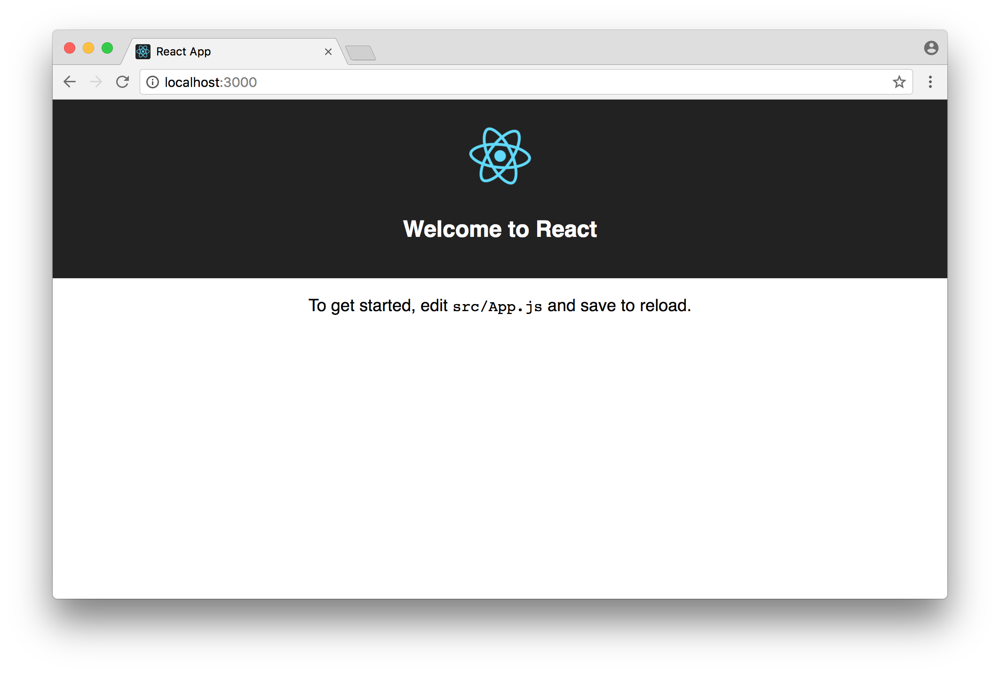
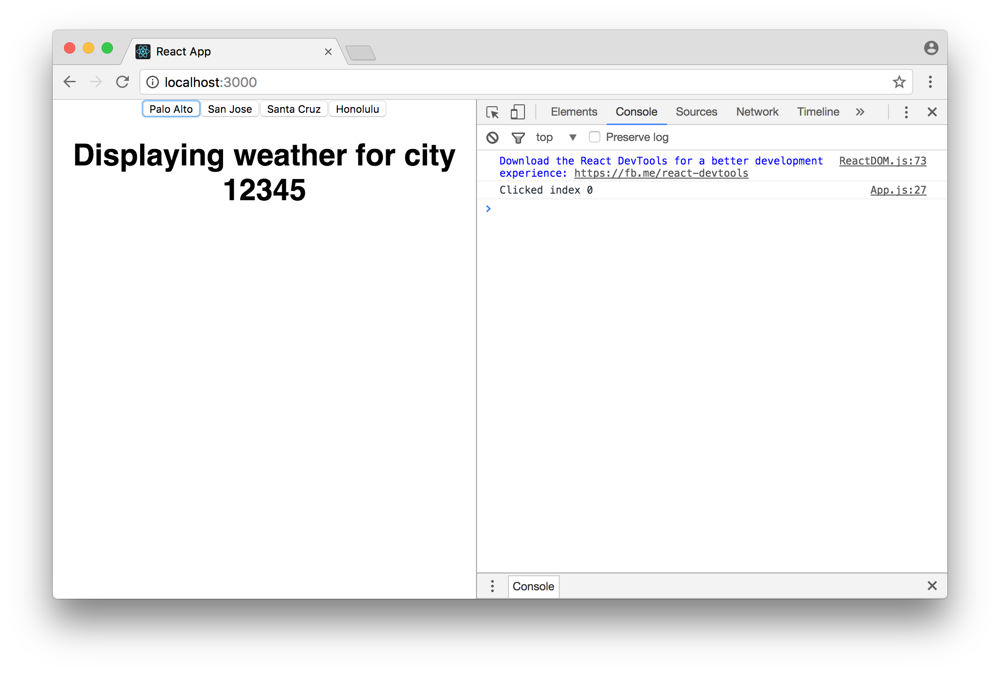
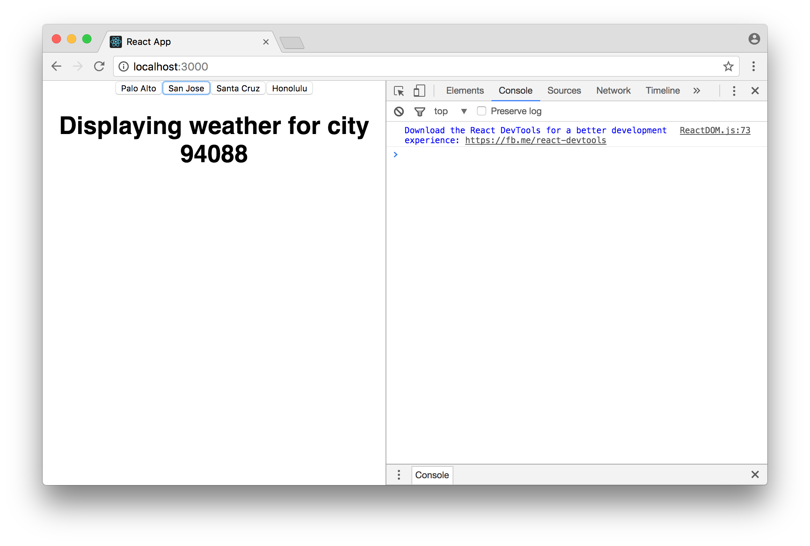
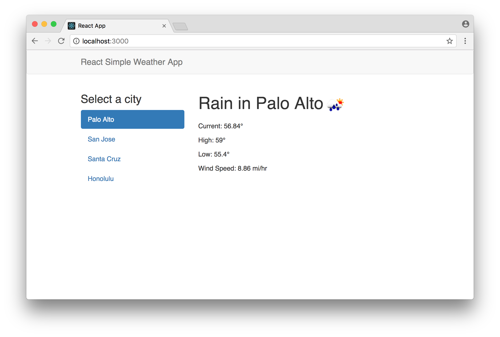

# Intro To React

[](https://vimeo.com/213710634)

Today we will walk through the creation of our first React web app!

At the end, we will have a simple production-ready weather app:


# Create your first app

First you'll need [node.js](https://nodejs.org/en/) and a JavaScript editor like [atom](https://atom.io/).

Next, open a terminal and install `create-react-app`:

```sh
npm install -g create-react-app
```

(Depending on your node installation, you may need to add "sudo" at the front of the `npm install -g` command)

Now we will create our sample Weather app:

```sh
create-react-app weather
```

Now a bunch of dev tools are getting installed, which will help you build your React app. When it completes, you can run the following to start your app:

```sh
cd weather
npm start
```

Now, your new app will load in your browser!



# Components and Props

Lets take a look at the basic app that was generated for us. In your editor, open `weather/src/App.js`. The app currently looks like this:

```js
class App extends Component {
  render() {
    return (
      <div className="App">
        <div className="App-header">
          
          <h2>Welcome to React</h2>
        </div>
        <p className="App-intro">
          To get started, edit <code>src/App.js</code> and save to reload.
        </p>
      </div>
    );
  }
}
```

Our whole app is in one component, and the render function is at the heart of it. Try modifying some text, save, and watch the app automatically show those changes!

Now lets go ahead and make a new component, `WeatherDisplay`. The render function is the heart of the component because it defines what will be displayed. For now, lets just display a `<h1>` HTML tag, with some text inside.

```js
class WeatherDisplay extends Component {
  render() {
    return (
      <h1>Displaying some Weather!</h1>
    );
  }
}
```

Lets modify our App component to use this new one.

```js
class App extends Component {
  render() {
    return (
      <div className="App">
        <WeatherDisplay zip={"12345"} />
      </div>
    );
  }
}
```

As you can see, we are passing data into `WeatherDisplay`. This data is a prop, called "zip". We can modify our component to display the data being passed in:

```js
class WeatherDisplay extends Component {
  render() {
    return (
      <h1>Displaying weather for city {this.props.zip}</h1>
    );
  }
}
```

Near the top of the file, lets add some different places that we might want to display weather for:

```js
const PLACES = [
  { name: "Palo Alto", zip: "94303" },
  { name: "San Jose", zip: "94088" },
  { name: "Santa Cruz", zip: "95062" },
  { name: "Honolulu", zip: "96803" }
];
```

Now, upgrade the App's render function to iterate over each place, and render a `<button>` tag for it.

```js
return (
  <div className="App">
    <WeatherDisplay zip={"12345"} />
    {PLACES.map((place, index) => (
      <button
        key={index}
        onClick={() => {
          console.log('Clicked index '+index);
        }}
      >
          {place.name}
      </button>
    ))}
  </div>
);
```

We are creating an array of `a` elements for it, and the `key` prop is used to tell React what is the order of the elements in the array.

There is also an `onClick` event handler, where we log the click to the console. You can see the log statements by opening the "Developer Tools" in your browser. Your app should now look like this:



At this point, [your `App.js` file should look like this](./1-Components-and-Props-App.js).

# State

We want our app to be able to switch between places, so we can use state to keep that data in our App component.

First, lets add a constructor function that will use the normal class `super` function, and then set up the initial `this.state`:

```js
constructor() {
  super();
  this.state = {
    activePlace: 0,
  };
}
```

Our `render` function can use the data from `this.state` when declaring the UI. To change state, we can use the React component's `setState` method, which will change the state and re-run the render function to get the new UI.

Let's use the `this.state` and `this.setState` in our App component:

```js
class App extends Component {
  constructor() {
    super();
    this.state = {
      activePlace: 0,
    };
  }
  render() {
    const activePlace = this.state.activePlace;
    return (
      <div className="App">
        {PLACES.map((place, index) => (
          <button
            key={index}
            onClick={() => {
              this.setState({ activePlace: index });
            }}
          >
              {place.name}
          </button>
        ))}
        <WeatherDisplay
          key={activePlace}
          zip={PLACES[activePlace].zip}
        />
      </div>
    );
  }
}
```



At this point, [your `App.js` file should look like this](./2-State-App.js).


# Lifecycle Methods and Data Fetching

Sometimes we want to add imperative code that gets called at certain times in our component's lifetime. The [lifecycle methods](https://facebook.github.io/react/docs/react-component.html#the-component-lifecycle) of a React component allows us to write additional code for these cases.

In this example, we want to make an API call when the component first shows up on screen, so we will add code to `componentDidMount`. Lets update the `WeatherDisplay` component to the following:

```js
class WeatherDisplay extends Component {
  constructor() {
    super();
    this.state = {
      weatherData: null
    };
  }
  componentDidMount() {
    const zip = this.props.zip;
    const URL = "http://api.openweathermap.org/data/2.5/weather?q=" +
      zip +
      "&appid=b1b35bba8b434a28a0be2a3e1071ae5b&units=imperial";
    fetch(URL).then(res => res.json()).then(json => {
      this.setState({ weatherData: json });
    });
  }
  render() {
    const weatherData = this.state.weatherData;
    if (!weatherData) return <div>Loading</div>;
    return <div>{JSON.stringify(weatherData)}</div>;
  }
}
```

Let's improve our render method so we can display the data nicely once it is loaded:

```js
const weather = weatherData.weather[0];
const iconUrl = "http://openweathermap.org/img/w/" + weather.icon + ".png";
return (
  <div>
    <h1>
      {weather.main} in {weatherData.name}
      
    </h1>
    <p>Current: {weatherData.main.temp}°</p>
    <p>High: {weatherData.main.temp_max}°</p>
    <p>Low: {weatherData.main.temp_min}°</p>
    <p>Wind Speed: {weatherData.wind.speed} mi/hr</p>
  </div>
);
```


At this point, [your `App.js` file should look like this](./3-Lifecycle-and-Data-App.js).


# Installing Components

Our app is still somewhat ugly. We can fix that by adding `className` props to our divs, and importing some CSS.

Or, we can install a library from `npm` that will help.

[Bootstrap](http://getbootstrap.com/) is popular UI toolkit for HTML and CSS. Let's install it, alongside `react-bootstrap` which provides the React components for it:

```sh
npm install --save bootstrap react-bootstrap
```

In the top of the app file, import the css from the bootstrap module:

```js
import "bootstrap/dist/css/bootstrap.css";
```

Next, import the components we want to use from `react-bootstrap`. You can find components on the [react-bootstrap site](https://react-bootstrap.github.io/components.html).

```js
import { Navbar, NavItem, Nav, Grid, Row, Col } from "react-bootstrap";
```

Now, replace the App component's render function to use the bootstrap components:

```js
<div>
  <Navbar>
    <Navbar.Header>
      <Navbar.Brand>
        React Simple Weather App
      </Navbar.Brand>
    </Navbar.Header>
  </Navbar>
  <Grid>
    <Row>
      <Col md={4} sm={4}>
        <h3>Select a city</h3>
        <Nav
          bsStyle="pills"
          stacked
          activeKey={activePlace}
          onSelect={index => {
            this.setState({ activePlace: index });
          }}
        >
          {PLACES.map((place, index) => (
            <NavItem key={index} eventKey={index}>{place.name}</NavItem>
          ))}
        </Nav>
      </Col>
      <Col md={8} sm={8}>
        <WeatherDisplay key={activePlace} zip={PLACES[activePlace].zip} />
      </Col>
    </Row>
  </Grid>
</div>
```



Now our app is starting to look more polished, but it would be nice to have a custom theme. We can install `bootswatch` to do that.

```sh
npm install --save bootswatch
```

[Browse the bootswatch website](http://bootswatch.com/) to find a theme, and install it by replacing the import of bootstrap css with the following. In this case we are using the 'journal' theme.

```js
import "bootswatch/journal/bootstrap.css";
```

The final, working app should look like this:


[The final source code of the app is here](./AppSnapshots/4-Installing-Components-App.js)

# Resources and other topics

- [React](reactjs.org) - Official Documentation
- [React Native](https://facebook.github.io/react-native/) - Use the same techniques to build mobile apps for iOS and Android
- [Redux](http://redux.js.org/) - Manage data in large applications when props become tedious
- [Relay](https://facebook.github.io/relay/) - Easily connect React Components with GraphQL data
- [Jest](https://facebook.github.io/jest/) - Test framework for JS
- [Flow](https://flow.org/) - Static type checker for JS

# Deploying - (Extra credit!)

It is very easy to deploy your new weather app.

First, publish your app's code to a Github repo. Then, browse to your repo and review the ReadMe file that is generated for your app. There are deployment instructions for many popular services.

One of the easiest services to use is Netlify, especially when you use the "continuous deployment" mechanism.
